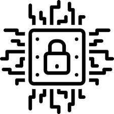
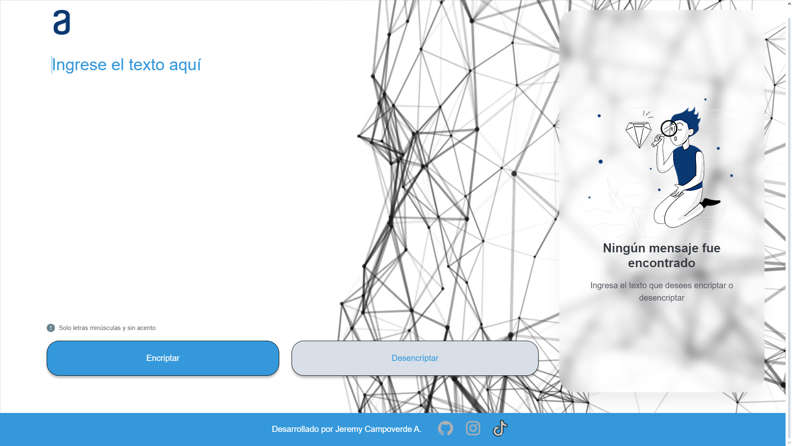
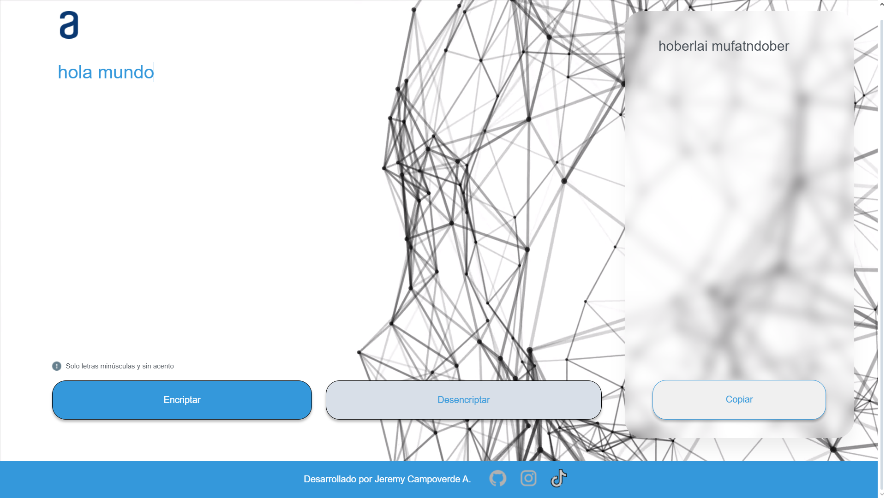
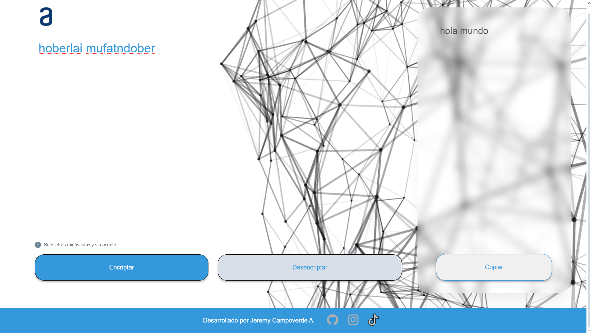
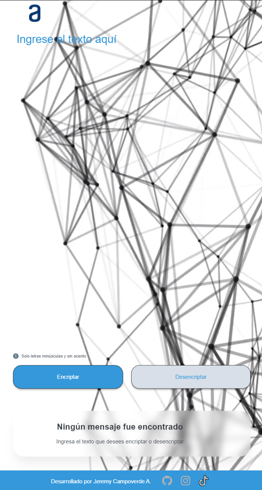
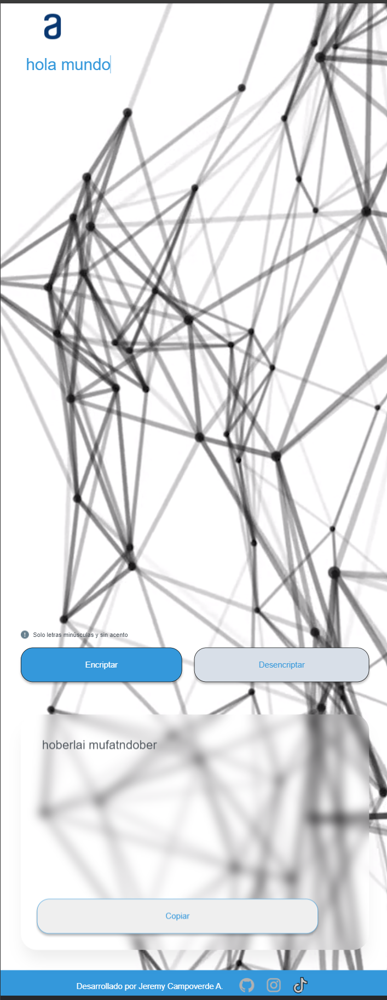
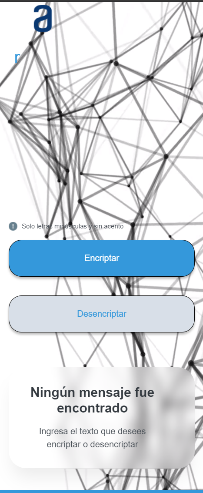
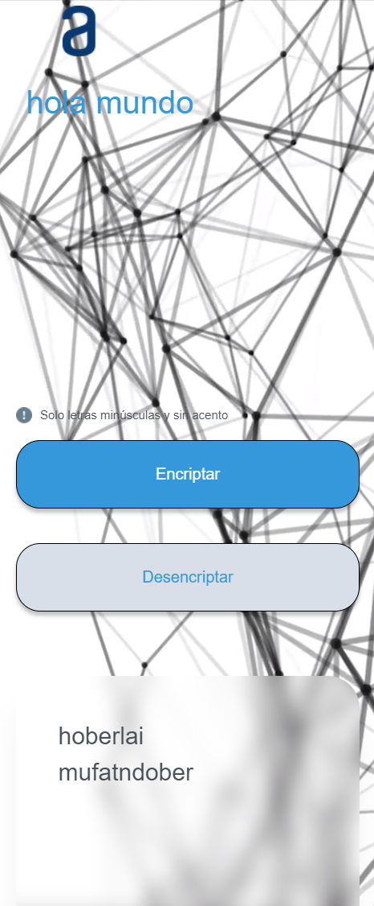

> [!NOTE]
> El proyecto aún se puede mejorar , tanto UI/UX como el funcionamiento de la lógica de encriptación.

<h1 align="center"> Encriptador de Texto </h1>

  

## Descripción General:

Este proyecto es una aplicación web que permite encriptar y desencriptar texto, utilizando un algoritmo básico de sustitución de letras:

- La letra "e" es convertida para "enter"
- La letra "i" es convertida para "imes"
- La letra "a" es convertida para "ai"
- La letra "o" es convertida para "ober"
- La letra "u" es convertida para "ufat"

### Por ejemplo:
- "gato" => "gaitober"
- gaitober" => "gato"

## Características Principales:

- Encriptación de texto: Convierte caracteres a su forma encriptada (por ejemplo, "a" se convierte en "ai").
- Desencriptación de texto: Convierte el texto encriptado a su forma original.
- Almacenamiento temporal de mensajes encriptados con opción de copiar.
- Gestión dinámica de botones en la interfaz (se crean y eliminan botones según sea necesario).
- Avisos interactivos para mejorar la experiencia del usuario.

## Tecnologías Utilizadas:

- Frontend: HTML, CSS, JavaScript
- Diseño: Flexbox y Media Queries para adaptabilidad a dispositivos móviles.
- Interacción Dinámica: DOM manipulation, event listeners, y manejo de formularios y botones.

## Requisitos:

- Esta aplicación online solamente admite el uso de letras minúsculas.
- No admite uso de caracteres especiales.
- Mediante el uso de 3 botones podrás:
  - Encriptar el texto ingresado.
  - Desencriptar el texto ingresado.
  - Copiar el resultado de la operación realizada.

## Cómo Funciona:

1. El usuario ingresa texto en un área de texto.
2. Al presionar el botón "Encriptar", el texto es transformado y mostrado en la sección de resultados.
3. El texto encriptado se almacena temporalmente en una lista de botones, donde se puede seleccionar, copiar o eliminar.

<h2 align="center"> Capturas del proyecto </h2>

<h3 align="center"> Main </h3>

  

<h3 align="center"> Encriptando texto </h3>

  

<h3 align="center"> Desencriptando texto </h3>

  

<h2 align="center"> Pantallas más pequeñas </h2>
<h3 align="center"> Main en pantalla tipo Tablet hasta 768px </h3>

  

<h3 align="center"> Encriptado en pantalla tipo Tablet hasta 768px </h3>

  

<h3 align="center"> Main en pantalla tipo celulares hasta 375px </h3>

  

<h3 align="center"> Encriptado en pantalla tipo celulares hasta 375px </h3>

  

Este proyecto fue realizado por Jeremy Campoverde

### Mis Redes Sociales

